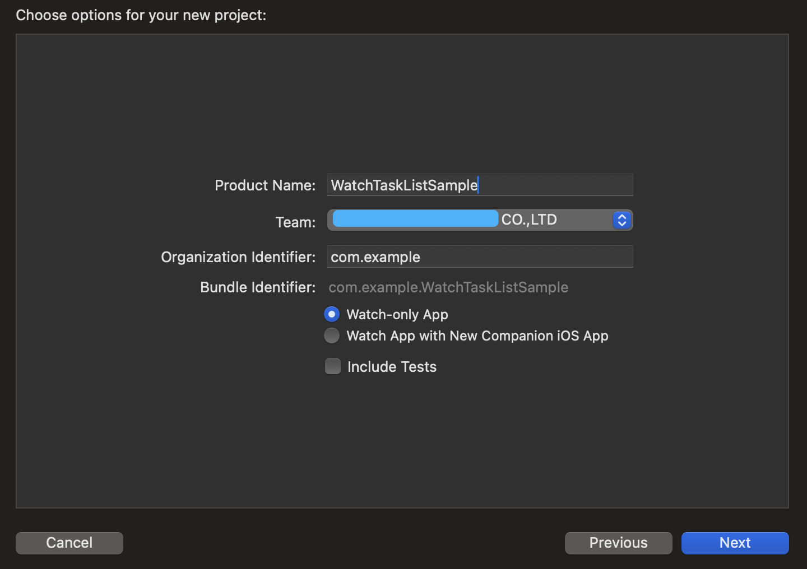

# WatchTaskListSample

[**【WWDC22 10133】实践项目：使用 SwiftUI 的新功能为 Apple Watch 构建出色的效率 App**](https://xiaozhuanlan.com/topic/2487691035)

> 摘要：“你的手腕从未像现在这样如此高效。”我们将使用 SwiftUI 在 Apple Watch 上实现滑行键入、与朋友共享内容及显示基本图表，构建一个跟踪「项目完成」效率的、全新的、独立的 watchOS App。

本文基于 [Session 10133](https://developer.apple.com/videos/play/wwdc2022/10133/) 梳理

## 回顾与概述

WWDC 2019，SwiftUI 横空出世，作为新时代声明式布局引擎，兼具性能、美感的同时，还有极低成本的接入方式、灵活的多平台适配等，这一切都让 Apple 开发者兴奋。2019 年也是 Apple Watch 及 WatchOS 最具里程碑的一年。Apple Watch Series 5 的 Always On，带来一块“永不熄灭的屏幕”。以及 watchOS 6 中引入了独立 Watch App，还有流式音频也让我们在没有 iPhone 的情况下随时随地欣赏多媒体内容。我们在 Apple Watch 里能做到的事越来越多。

每年，Apple 都会带来 SwiftUI 在 watchOS 上的新功能。今年的 WWDC 也不负众望。

“你的手腕从未像现在这样如此高效。”我们将使用 SwiftUI 在 Apple Watch 上实现滑行键入、与朋友共享内容及显示基本图表，构建一个跟踪「项目完成」效率的、全新的、独立的 watchOS App。

本文是实践项目，鼓励读者跟随文章流程，一起来完成该项目，从而简单了解并使用包括“NavigationStack”、“Transferable”、“Swift Chart”在内的新功能。本文不需要太深入的 SwiftUI 、watchOS 经验，在掌握基础的 SwiftUI 开发上，可直接上手尝试。

## 项目概览

我们将共同创建一个 Watch App，主要流程如下：

1. 构建可供用户添加并显示的简单的项目列表，同时用户可以编辑这些项目；
2. 将讨论 Watch App 中常见的导航策略及如何选择正确的导航策略；
3. 构建分享功能，用户可以与朋友们分享项目；
4. 构建一个图表，帮助用户了解自身的效率趋势；
5. 使用数码表冠让图表滚动，显示图表更大的范围和展示每项的细节。

## 创建 Watch App

### 创建项目与项目设计

在“watchOS”选项卡中，选择“App”，然后单击“Next”。填入“Product Name”后，我们还需要进行几个选择。最重要的选择是创建一个「独立的 Watch App」项目还是创建一个「Watch App 与配套的 iOS App」项目。




#### 如何创造出色的 Watch App：

- 快速交互，用户可以快速访问重要的信息或功能
- 专注于应用程序的基本目的，用户可以轻松找到所需的信息或操作
- 在独立于 iPhone 时也有完善的功能体验
- 某些情况下， Watch App 应有一个配套的 iOS App，例如在 iPhone 上，健身 App 的历史记录或趋势的详细分析中，也包含 Apple Watch 捕获的数据

---

### 谈谈新的 Target

我们过去创建一个 Watch App Project，那么项目会有两个 Watch Target：

- 「WatchKit App」Target，其中包含 storyboard、assets，可能还有一些与本地化相关的文件。
- 「WatchKit Extension」Target，其中包含 Watch App 本身的所有代码。

这两个 Target 是 watchOS 早期的产物，如今开发一款 Watch App，开发者很少与「WatchKit App」Target 进行互动，刚接触 watchOS 开发的同学可能也难以理解这些 Target 间的差异，Apple 有充分的理由对 Target 进行调整

现在，喜大普奔，Apple 终于解决了这一问题。从 Xcode 14 开始，新的 Watch App Project 只有有一个 「Watch App」 Target。与 Watch App 相关的所有代码、assets、本地化文件以及 Siri Intent 和 Widget 扩展等都属于此 Target。


此外，单 Target 的 Watch App 向下支持到 watchOS 7！我们可以根据实际情况来简化项目结构、减少不必要的混淆和重复。

如果我们的现有应用程序具有 「 WatchKit Extension」Target，那么它可以继续工作，可以继续使用 Xcode 更新应用程序并通过 App Store 进行发布

如果我们已经有一个使用 SwiftUI 的 Watch 应用程序，并且部署在 watchOS 7 或更高版本，那么使用 Xcode 14 中的迁移工具可以轻松将项目转换到单 Target

选择「WatchKit App」Target 并从“Editor”菜单中选择“Validate Settings”。现在是将我们的 App 转换为使用 SwiftUI，享受 SwiftUI 的所有功能的同时，享受单 Target 的 Watch App 的简单与整洁的最好时机。


### 图标的简化

Target 并不是 Apple 在 Xcode 14 中唯一简化的东西，还简化了为 App 添加图标的过程。现在只需一张 1024x1024 像素的图片即可。


应用程序图标图像将自动缩放，从而显示在所有该 App 相关的所有位置上。包括 Apple Watch 的主屏幕、通知以及 iPhone 上的 Watch 应用程序的已安装列表。

但如果该图标在缩放到小尺寸时丢失细节，我们最好还是为特定场景添加小尺寸的或细节简化后的自定义图像来达到最好的用户体验。


### 添加列表

下面，我们将为我们的 App 添加一些功能，首先是添加任务项列表。

我们将从创建一个 `ListItem` Model 开始。`ListItem` 结构是 `Identifiable` 和 `Hashable` 的，提供一个 `description` 用来显示。


```Swift
// Create a list item
struct ListItem: Identifiable, Hashable {
    let id = UUID()
    
    let description: String
    
    init(_ description: String) {
        self.description = description
    }
}
```

`Identifiable` 指[一类类型，其实例持有具有稳定标识的实体的值](https://developer.apple.com/documentation/swift/identifiable)。主要作用就是作为一个对象的唯一标识。符合 `Identifiable` 协议的类型需要指定关联类型 `associatedtype ID : Hashable` 和指定识别项 `var id: Self.ID`。

然后，创建一个简单的 `ItemListModel` 来存储我们的 `ListItem` Model，`ItemListModel` 遵循 `ObservableObject` 协议，用 `@Published` 包装 `items`

```Swift
// Create a model
class ItemListModel: NSObject, ObservableObject {
    @Published var items = [ListItem]()
}
```

`ObservableObject` 是[一种具有 `objectWillChange` 的发布者的对象，在对象更改之前发出事件](https://developer.apple.com/documentation/combine/observableobject)。同时，要在数据更改时触发 `objectWillChange` 事件，需要使用 [`@Published`](https://developer.apple.com/documentation/combine/published) 属性包装器包装对应属性。

最后，将 `itemListModel` 添加为 `environmentObject`，以便我们的视图可以访问该 model。

```Swift
// Add the model as an environment object

@main
struct WatchTaskListSample_Watch_AppApp: App {
    @StateObject var itemListModel = ItemListModel()
    
    var body: some Scene {
        WindowGroup {
            NavigationStack {
                ContentView()
                    .environmentObject(itemListModel)
            }
        }
    }
}

```

`@StateObject` 是[实例化「可观察对象」的属性包装器类型](https://developer.apple.com/documentation/swiftui/stateobject)。`@State` 和 `@StateObject` 的区别在对属性的观察粒度，`@State` 是以整个属性为单位进行观察，而 `@StateObject` 观察属性的内部属性。因此，`@State` 多用于值类型，`@StateObject` 多用于引用类型，因而 `@StateObject` 需要配合 `ObservableObject` 和 `@Published` 使用。

现在让我们使用 model 在 `ContentView` 的 `body` 中创建一个 `List`。由于还没有 `items`，所以当我们预览它时，我们会看到一个空 `List`。

```
struct ContentView: View {
    @EnvironmentObject private var model: ItemListModel
    
    var body: some View {
        List {
            ForEach(model.items) { item in
                Text(item.description)
            }
            if model.items.isEmpty {
                Text("No items to do!")
                    .foregroundStyle(.gray)
            }
        }
        .navigationTitle("Tasks")
    }
}
```


> `@EnvironmentObject` 是[获取由父视图或祖先视图提供的可观察对象的属性包装器类型](https://xiaozhuanlan.com/topic/(https://developer.apple.com/documentation/swiftui/environmentobject))。


### 列表更新

#### 探索 TextFieldLink

我们需要给用户提供将项目添加到列表中的方法。我们将展示一个按钮，用户点击该按钮将新项目添加到列表中。

`TextFieldLink` 是 watchOS 9 中的新功能，可让用户从按钮调用文本输入选项，并提供多种样式。

我们可以使用简单的字符串或者 `Label` 来创建 `TextFieldLink`。

```
struct ContentView: View {
    @EnvironmentObject private var model: ItemListModel

    var body: some View {
        VStack {
            TextFieldLink("Add") {
                model.items.append(ListItem($0))
            }
        }
        .navigationTitle("Tasks")
    }
}
```


```
struct ContentView: View {
    @EnvironmentObject private var model: ItemListModel

    var body: some View {
        VStack {
            // Label方式
            TextFieldLink {
                Label("Add", systemImage: "plus.circle.fill")
            } onSubmit: {
                model.items.append(ListItem($0))
            }

        }
        .navigationTitle("Tasks")
    }
}
```


设置强调色:


我们可以使用视图修饰符修改按钮的外观，包括 `foregroundColor`、`foregroundStyle` 和 `buttonStyle` 等。


我们可以创建一个 `AddItemLink` 来封装刚刚提到的 `TextFieldLink` 的样式和行为。当用户输入文本后，会生成新 `ListItem`。并将新生成项目添加到 model 的 `items` 中从而展示在列表里。


```
struct AddItemLink: View {
    @EnvironmentObject private var model: ItemListModel
    
    var body: some View {
        TextFieldLink(prompt: Text("New Item")) {
            Label("Add", systemImage: "plus.circle.fill")
        } onSubmit: {
            model.items.append(ListItem($0))
        }
        Spacer()
            .frame(height: 5.0)
    }
}
```

对于**长列表**的常用操作，请使用 `toolbar` 将操作放置在列表顶部。

我们无法确定用户的将会有多少个列表项，因此我们将 `toolbar` 添加到列表中，并将 `AddItemLink()` 作为 `toolbar` 的内容，以便用户快速访问。

让我们回顾一下已完成的工作：我们为列表项创建了一个 `ItemListModel`，将其设置为环境对象，然后创建了一个 `List` 来显示这些项目，并使用 `TextFieldLink` 供用户添加新项目。


创建一个只有描述信息的 model 很简单，但对于用户来说这并不很实用。我们需要将项目标记为是否完成，并且我们可能需要设置项目优先级或添加对项目工作时长的估计。

因此，我们下面将添加一个项目的详情视图。在这之前，我们整理一下 SwiftUI 在 Watch App 中的导航方案。

## 应用导航方案

### 应用导航结构类型


分层导航结构用于具有「列表-详细信息」关系的视图。从 watchOS 9 开始，可以使用 SwiftUI 的 `NavigationStack` 创建具有这种导航结构的界面。

基于页面的导航用于具有平面结构的视图，其中所有视图都是对等的。例如健身 App 在用户运动时显示的视图，用户可以在锻炼期间轻松的在控件、指标和播放滑动。


全屏应用程序具有使用整个屏幕显示的单个视图。通常用于具有单一主视图的游戏等应用程序。对于全屏视图，可以使用 `ignoresSafeArea` 修饰显示边缘，或者使用 `hidden` 的 `toolbar` 来隐藏 `navigationBar`。

模态是在当前视图上滑动的全屏视图，它一般应用于展示当前工作流程中必须完成的重要部分。

区分何时使用分层导航与何时使用模态很重要。Mail App 使用分层导航来显示消息列表，并将每条消息显示为详细视图。


如果我们返回列表并点击“New Messages”，Mail App 使用模态显示创建新消息视图。


#### 使用模态

模态应该是我们项目的正确选择，因为用户正在编辑一个项目，并且我们希望用户专注于这个单一任务，直到用户点击完成或取消。

要显示模态，我们需要创建一个属性来控制模态展示状态。根据用户界面中的操作来设置该属性，并在状态属性为 `true` 时使用 `sheet` 修饰符显示自定义模态内容。

```
struct ItemRow: View {
    @EnvironmentObject private var model: ItemListModel
    @Binding var item: ListItem
    @State private var showDetail = false
    var body: some View {
        Button(action: {
            showDetail = true
        }, label: {
            Text(item.description)
        })
        .sheet(isPresented: $showDetail, content: {
            ItemDetail(item: $item)
        })
    }
}
```

要将自定义的 `toolbar` 项添加到模态视图，我们可以做以下改动。我们的 `toolbar` 应提供 `placement` 参数，如使用 `confirmationAction`、`cancellationAction` 或 `destructiveAction`。

```
struct ItemRow: View {
    @EnvironmentObject private var model: ItemListModel
    @Binding var item: ListItem
    @State private var showDetail = false
    var body: some View {
        Button(action: {
            showDetail = true
        }, label: {
            Text(item.description)
        })
        .sheet(isPresented: $showDetail, content: {
            ItemDetail(item: $item)
                .toolbar {
                    ToolbarItem(placement: .confirmationAction) {
                        Button("Done") {
                            showDetail = false
                        }
                    }
                }
        })
    }
}
```

#### 更新列表

现在我们已经完成 `List` 导航到 `ItemDetail` 的代码，接着我们将更新我们的 `ListItem` 结构。我们增加新的属性来存储估计的工作、创建日期和完成日期，以及一个计算属性 `isComplete` 标记该项目是否完成。

```
import Foundation

// Create a list item
struct ListItem: Identifiable, Hashable {
    let id = UUID()
    var description: String
    var estimatedWork: Double = 1.0
    var creationDate: Date = Date()
    var completionDate: Date?
    
    init(_ description: String) {
        self.description = description
    }
    
    var isComplete: Bool {
        get {
            completionDate != nil
        }
        set {
            if newValue {
                guard completionDate == nil else {
                    return
                }
                completionDate = Date()
            } else {
                completionDate = nil
            }
        }
    }
}
```

让我们为用户提供一种查看和编辑这些详细信息的方法。

我们将创建一个带有 `TextField` 的详细视图，来编辑 `description`，还有一个将任务标记为完成与否的 `Toggle`。

```
struct ItemDetail: View {
    @Binding var item: ListItem
    var body: some View {
        Form {
            Section("List Item") {
                TextField("Item", text: $item.description, prompt: Text("List Item"))
            }
            Toggle(isOn: $item.isComplete, label: {
                Text("Completed")
            })
        }
    }
}
```

但我们应该如何实现预估的工作时长？我们知道这是一个数字，我们可以指定一个有效值的范围供用户输入。但从 watchOS 9 开始，当我们想要提供精细控制来编辑顺序值时，我们有了另一个很好的选择——`Stepper`。我们可以指定一系列值并可选择提供一个步进值。

```
Stepper(value: $item.estimatedWork,
                    in: (0.0...14.0),
                    step: 0.5,
                    format: .number) {
                Text("\(item.estimatedWork, specifier: "%.1f")days")
            }
```


我们还可以使用 `Stepper` 来编辑其他值。也许我们想记录项目的估计压力水平，我们可以创建一个表情符号数组来表示对应压力水平，然后创建一个 `Stepper`，将值绑定到表情符号数组的索引，并将范围设置为数组索引的范围。选择表情来代表该项目估计的压力水平。

```
// Use a Stepper to edit the stress level of an item
struct StressStepper: View {
    private let stressLevels = [
        "😱", "😡", "😳", "🙁", "🫤", "🙂", "🥳"
    ]
    @State private var stressLevelIndex = 5
    
    var body: some View {
        VStack {
            Text("Stress Level")
                .font(.system(.footnote, weight: .bold))
                .foregroundStyle(.tint)
            Stepper(value: $stressLevelIndex,
                    in: (0...stressLevels.count - 1)) {
                Text(stressLevels[stressLevelIndex])
            }
        }
    }
}
```


#### 共享项目

假如这篇文章很有趣嘿嘿～你想分享给你的朋友。或者当我们的项目列表上有很多让我们压力山大的项目时，我们想与朋友分享其中的一个项目来寻求帮助或者贴贴。

我们将在详细视图中添加一个按钮，允许用户共享项目。我希望能够点击详细视图上的按钮来分享项目、从好友列表中选择朋友以寻求帮助、编辑消息并发送。


为此，Apple 在 watchOS 9 的 SwiftUI 中增加了新工具：`ShareLink`。我们可以通过创建一个 `ShareLink` 来让用户共享项目。同时，我们可以选择使用自定义的主题和消息。并在在共享表中提供预览。我们可以使用 `ShareLink` 在 iOS、macOS 和 watchOS 中的 SwiftUI App 中进行共享。

```
ShareLink(item: item.description,
                      subject: Text("Please help!"),
                      message: Text("(I need some help finishing this.)"),
                      preview: SharePreview("\(item.description)"))
            .buttonStyle(.borderedProminent)
            .buttonBorderShape(.roundedRectangle)
            .listRowInsets(EdgeInsets(top: 0, leading: 0, bottom: 0, trailing: 0))
```

#### 添加图标

现在，我们还想添加一个图表来帮助用户查看工作效率，我们将选择使用柱状图。

我们首先将图表视图添加到应用程序的导航结构中。这里我们选择了基于页面的导航策略，因为项目列表和图表之间没有「列表-详细视图」关系。用户更希望随时在列表和图表之间滑动。

要为我们的列表和图表添加基于页面的导航，首先创建一个 `ItemList` 来将之前的列表视图封装。

```
struct ItemList: View {
    @EnvironmentObject private var model: ItemListModel
    
    var body: some View {
        List {
            ForEach($model.items) { $item in
                ItemRow(item: $item)
            }
            if model.items.isEmpty {
                Text("No items to do!")
                    .foregroundStyle(.gray)
            }
        }
        .toolbar{
            AddItemLink()
        }
        .navigationTitle("Tasks")
    }
}
```

我们将之前 `ContentView` 的全部内容移到了 `ItemList` 中。这样让 `ContentView` 拥有更简单、易于阅读的选项卡视图代码。

我们还需要为我们的图表视图创建一个新结构。我们暂时放置一个占位符，在构建图表之前，我们将专注于完成导航结构。

```
struct ProductivityChart: View {
    var body: some View {
        Image(systemName: "chart.bar.fill")
            .navigationTitle("Productivity")
    }
}
```

现在我们将设置一个带有页面样式选项卡视图的 `ContentView`，该视图具有 2 个选项卡：项目列表和图表。

```
struct ContentView: View {
    var body: some View {
        TabView {
            NavigationStack {
                ItemList()
            }
            NavigationStack {
                ProductivityChart()
            }
        }
        .tabViewStyle(.page)
    }
}
```


在“添加列表”部分，我们在 `struct WatchTaskLiskSample_Watch_AppApp` 里写了 `NavigationStack { ContentView().environmentObject(itemListModel) }` 这几行代码，现在可以删除这部分的 `NavigationStack` 结构。

```
import SwiftUI

// Add the model as an environment object

@main
struct WatchTaskListSample_Watch_AppApp: App {
    @StateObject var itemListModel = ItemListModel()
    
    var body: some Scene {
        WindowGroup {
            ContentView()
                .environmentObject(itemListModel)
        }
    }
}
```


我们已经建立了我们的导航结构，下面来谈谈如何构建这个图表。之前，我们可以使用 SwiftUI Canvas 来绘制图表，但从 watchOS 9 开始，我们有一个更简单的答案：Swift Charts。 Swift Charts 也可在 iOS、macOS 和 tvOS 上使用，可以在任何使用 SwiftUI 的地方复用我们的代码。

我们将聚合需要绘制图表的数据，然后交给 Swift Charts 来显示它。我们希望显示按日期来展示完成的项目数。

我们首先创建一个 `DataElement` 结构来存储图表的数据，然后编写一个方法将 `ListItem` 数组转换为 `DataElement` 数组作为图表的数据源。

```
import Foundation

struct ChartData {
    struct DataElement: Identifiable {
        var id: Date { return date }
        let date: Date
        let itemsComplete: Double
    }
    
    static func createData(_ items: [ListItem]) -> [DataElement] {
        return Dictionary(grouping: items, by: \.completionDate)
            .compactMap {
                guard let date = $0 else { return nil }
                return DataElement(date: date, itemsComplete: Double($1.count))
            }
            .sorted {
                $0.date < $1.date
            }
    }
}
```

为了便于调试，我们也需要一些简单的模拟数据。

```
extension ChartData {
    static var chartSampleData: [DataElement] {
        let calendar = Calendar.autoupdatingCurrent
        var startDateComponents = calendar.dateComponents(
            [.year, .month, .day], from: Date())
        startDateComponents.setValue(22, for: .day)
        startDateComponents.setValue(5, for: .month)
        startDateComponents.setValue(2022, for: .year)
        startDateComponents.setValue(0, for: .hour)
        startDateComponents.setValue(0, for: .minute)
        startDateComponents.setValue(0, for: .second)
        let startDate = calendar.date(from: startDateComponents)!
        let itemsToAdd = [
            6, 3, 1, 4, 1, 2, 7,
            5, 2, 0, 5, 2, 3, 9
        ]
        var items = [DataElement]()
        for dayOffset in 0 ..< itemsToAdd.count {
            items.append(DataElement(
                date: calendar.date(byAdding: .day, value: dayOffset, to: startDate)!,
                itemsComplete: Double(itemsToAdd[dayOffset])))
        }
        return items
    }
}
```

通过指定要显示的数据并根据数据定义系列来显示一个简单的图表。我们将日期用作 x 值，将完成的项目数用作 y 值。

```
import SwiftUI
import Charts

struct ProductivityChart: View {
    let data = ChartData.chartSampleData
    var body: some View {
        Chart(data) { dataPoint in
            BarMark (
                x: .value("Date", dataPoint.date),
                y: .value("Completed", dataPoint.itemsComplete)
            )
            .foregroundStyle(Color.accentColor)
        }
        .navigationTitle("Productivity")
    }
}
```

为了在 Watch 上显示我们想要的样式，我们使用 Chart 的 `chartXAxis` 修饰符自定义 x 轴。我们也不需要垂直网格线，所以我们省略了 `AxisGridLine` 标记。

```
.chartXAxis {
    AxisMarks { _ in
        AxisValueLabel(format: shortDateFormatStyle)
    }
}
```

我们还可以使用 `chartYAxis` 修饰符自定义 y 轴。我们指定了一个网格线样式，它在图表看起来不错。此外，我们将 Y 轴标签格式化为整数，并省略最顶部的标签，防止它在图表顶部被剪裁。

```
.chartYAxis {
    AxisMarks { value in
        AxisGridLine(
            stroke: StrokeStyle(lineWidth:0.5)
        )
        .foregroundStyle(Color.gray)
        if value.index < (value.count - 1) {
            AxisValueLabel(format: IntegerFormatStyle())
        }
    }
}
```

## 与表冠交互

### 展示当前表冠位置

我们的图表现在看起来很不错，但我们想显示更多数据，并且仍保持出色的 Watch App 体验，因此我们将使表格可滚动。

为此，我们将使用一个新的 `digitalCrownRotation`，它允许我们为数码表冠事件设置回调，我们将为图表实现自定义滚动行为。

我们首先添加 `highlightedDateIndex`，这是当前滚动位置的数据点的索引。

我们也需要存储表冠偏移量 `crownOffset`，以便在图表上滚动时显示当前表冠位置。这个值可以是一个中间值，表示在数据点上或数据点之间。

为了跟踪用户是否在滚动表冠，我们将存储滚动空闲状态 `isCrownIdle`，我们将使用这些信息来添加一个动画作为皇冠滚动停止和开始。

```
struct ProductivityChart: View {
    // ...

    @State private var highlightedDateIndex: Int = 0

    @State private var crownOffset: Double = 0.0

    @State private var isCrownIdle = true

    // ...
}
```

我们先将上部分的 `chart` 拆分，以便项目更佳整洁。同时我们可以添加 `digitalCrownRotation` 修饰符。

```
chart
    .focusable()
    .digitalCrownRotation(
        detent: $highlightedDateIndex,
        from: 0,
        through: data.count - 1,
        by: 1,
        sensitivity: .medium
    ) { crownEvent in
        isCrownIdle = false
        crownOffset = crownEvent.offset
    } onIdle: {
        isCrownIdle = true
    }
    .navigationTitle("Productivity")
    .navigationBarTitleDisplayMode(.inline)
```

`detent` 是 [watchOS 9.0+ Bata](https://developer.apple.com/documentation/swiftui/form/digitalcrownrotation(detent:from:through:by:sensitivity:iscontinuous:ishapticfeedbackenabled:onchange:onidle:)-7a14) 的新 modifier。我们将 `detent` 值绑定到 `highlightDateIndex` 属性。

在 `onChange` 回调中，因为我们知道表冠此时正在滚动，所以将 `isCrownIdle` 的值设置为 `false`，同时将 `crownOffset` 值设置为表冠滚动事件的位移值 `crownEvent.offset` ，以便在在滚动期间显示当前位置。

```
isCrownIdle = false
crownOffset = crownEvent.offset
```

在 `onIdle` 回调的处理程序中，我们将 `isCrownIdle` 的值设置为 `true`。

```
isCrownIdle = true
```

现在我们可以在图表上滚动时显示表冠的位置。

接着，我们可以使用 Swift Charts 中的 `RuleMark`。 `RuleMark` 是图表上的一条直线。我们可以使用它来显示水平线或垂直线、显示阈值或显示斜线。我们可以创建一个带有表冠偏移日期值的 `RuleMark` 以显示表冠滚动的当前位置。

```
private var chart: some View {
    Chart(data) { dataPoint in
        BarMark(
            x: .value("Date", dataPoint.date),
            y: .value("Completed", dataPoint.itemsComplete)
        )
        .foregroundStyle(Color.accentColor)
        RuleMark(x: .value("Date", crownOffsetDate))
            .foregroundStyle(Color.yellow)
    }
    // ...

    private var crownOffsetDate: Date {
        let dateDistance = data[0].date.distance(
            to: data[data.count - 1].date) * (crownOffset / Double(data.count - 1))
        return data[0].date.addingTimeInterval(dateDistance)
    }
```

假如我们想让表冠位置线在表冠停止移动时展示褪色动画。可以使用我们添加的 `isCrownIdle` 属性对其进行动画处理很简单。

我们将添加一个属性来存储我们在 `RuleMark` 的 `foregroundStyle` 中使用的颜色的不透明度。并在图表中添加一个 `onChange` 修改器，以在 `isCrownIdle` 值更改时，为 `crownPositionOpacity` 值以动画方式更改。

```
struct ProductivityChart: View {
    // ...

    @State var crownPositionOpacity: CGFloat = 0.2

    // ...
    var body: some View {
        chart
            // ...
            .onChange(of: isCrownIdle) { newValue in
                withAnimation(newValue ? .easeOut : .easeIn) {
                    crownPositionOpacity = newValue ? 0.2 : 1.0
                }
            }
            // ...
    }
}
```

然后更新 `RuleMark` 的 `foregroundStyle`，使用透明度。

```
RuleMark(x: .value("Date", crownOffsetDate))
    .foregroundStyle(Color.yellow.opacity(crownPositionOpacity))
```

要在滚动时在图表上的条形旁边显示值，我们可以向 BarMark 添加 `annotation`。当它是最后一项时，我们会将注释定位在条的顶部前导侧。否则，会将其定位在顶部尾随侧。

```swift
BarMark(
    x: .value("Date", dataPoint.date),
    y: .value("Completed", dataPoint.itemsComplete)
)
.annotation(
    position: isLastDataPoint(dataPoint) ? .topLeading : .topTrailing,
    spacing: 0
) {
    Text("\(dataPoint.itemsComplete, format: .number)")
        .foregroundStyle(dataPoint.date == crownOffsetDate ? Color.yellow : Color.clear)
}
```

以上，我们仅使用 `digitalCrownRotation` 修饰符、Swift Charts 中的 `RuleMark` 和一个简单的 SwiftUI 动画完成了项目。

### 让图表动起来

现在，我们的项目与演示图相差无几，唯一的差别是我们的图表的数据范围还是静止的，最后一步我们会实现数据范围的调整。我们创建一个属性来存储可见范围，在 `highlightedDateIndex` 变化时，提供一个方法来计算新的可见范围。并将 `chart` 的数据源调整为新的数据源。

```
// ...

@State var chartDataRange = (0...6)

// ...

var body: some View {
    chart
        // ...
        .onChange(of: highlightedDateIndex) { newValue in
            withAnimation {
                updateChartDataRange()
            }
        }
        // ...
}
private var chart: some View {
    Chart(chartData) { dataPoint in
    // ...
    }
}

private func updateChartDataRange() {
    if (highlightedDateIndex - chartDataRange.lowerBound) < 2, chartDataRange.lowerBound > 0 {
        let newLowerBound = max(0, chartDataRange.lowerBound - 1)
        let newUpperBound = min(newLowerBound + 6, data.count - 1)
        chartDataRange = (newLowerBound...newUpperBound)
        return
    }
    if (chartDataRange.upperBound - highlightedDateIndex) < 2, chartDataRange.upperBound < data.count - 1 {
        let newUpperBound = min(chartDataRange.upperBound + 1, data.count - 1)
        let newLowerBound = max(0, newUpperBound - 6)
        chartDataRange = (newLowerBound...newUpperBound)
        return
    }
}

private var chartData: [ChartData.DataElement] {
    Array(data[chartDataRange.clamped(to: (0...data.count - 1))])
}
```

现在，当用户使用表冠在图表上滚动时，图表将更新数据源来显示可用数据。至此，我们完成了 Watch App 最初计划的所有功能。

## 总结

今年，WWDC 带来了全新的 SwiftUI 导航设计、带来了更便捷更通用的分享能力，以及开箱即用的图表帮助我们精美的实现数据的可视化。SwiftUI 的完善程度进一步提高，我们的开发也更有乐趣～

作为开发者，我们也要具有“产品思维”、“设计思维”，在设计 Watch App 时，选择合适的导航策略等交互方式，以确保我们的应用程序更出色、更具有吸用力。使用 SwiftUI 开发 Apple Watch App 也早已成为更合适、更简单、更丰富的选择。因为有我们，才有优质的 App！

Apple 提供的项目源码请参考“[Building a productivity app for Apple Watch](https://developer.apple.com/documentation/watchos-apps/building_a_productivity_app_for_apple_watch)”.

笔者实现的源码请参考[这里](https://github.com/LLLLLayer/WWDC22-Session-10133-Build-a-productivity-app-for-Apple-Watch)，欢迎大家共同交流！
